# TypeRush Architecture Diagram

## Simplified Architecture Diagram

```mermaid
graph TB
    %% User Access Layer
    User([👤 Users])

    %% Edge Layer
    subgraph Edge["🌐 Edge & CDN Layer"]
        R53[Route 53<br/>DNS]
        CF[CloudFront CDN<br/>Static Assets & API Cache]
        WAF[AWS WAF<br/>Rate Limiting & Security]
    end

    %% Authentication
    Cognito[AWS Cognito<br/>User Authentication]

    %% API Layer
    subgraph APIGateway["🔌 API Gateway Layer"]
        APIGW_HTTP[API Gateway HTTP<br/>REST APIs]
        APIGW_WS[API Gateway WebSocket<br/>Real-time Gameplay]
    end

    %% VPC Boundary
    subgraph VPC["☁️ VPC ap-southeast-1 Single AZ"]

        %% Public Subnet
        subgraph PublicSubnet["🌍 Public Subnet 10.0.1.0/24"]
            IGW[Internet Gateway]
            NAT[NAT Gateway<br/>$32/mo<br/>⚠️ Required for ECS/Lambda init]
        end

        %% Private Subnet
        subgraph PrivateSubnet["🔒 Private Subnet 10.0.101.0/24"]

            %% VPC Link
            VPCLink[VPC Link<br/>PrivateLink]

            %% Load Balancer
            ALB[Internal ALB<br/>Private Only<br/>Health: /health]

            %% Compute Layer
            subgraph Compute["💻 Compute Layer"]
                ECS[ECS Fargate<br/>Game Service<br/>Node.js + Express<br/>0.25 vCPU, 0.5GB<br/>Min: 1, Max: 2<br/>Auto-scale on CPU]

                LambdaRecord[Lambda<br/>Record Service<br/>NestJS + Prisma<br/>512MB, 30s timeout]

                LambdaText[Lambda<br/>Text Service<br/>Python + FastAPI<br/>512MB, 60s timeout]
            end

            %% Data Layer
            subgraph DataLayer["💾 Data Layer"]
                Redis[ElastiCache Redis<br/>cache.t4g.micro<br/>$12/mo<br/>Game Session State]

                RDS[RDS PostgreSQL<br/>Record DB<br/>db.t3.micro<br/>Single-AZ<br/>Accounts + Game History]

                DDB[DynamoDB<br/>Text Storage<br/>On-Demand]
            end            %% VPC Endpoints
            subgraph VPCEndpoints["🔗 VPC Endpoints"]
                direction LR
                EPSecrets[Secrets Manager<br/>Interface $7/mo]
                EPBedrock[Bedrock Runtime<br/>Interface $7/mo]
                EPECR1[ECR API<br/>Interface $7/mo]
                EPECR2[ECR Docker<br/>Interface $7/mo]
                EPS3[S3 Gateway<br/>FREE]
                EPDynamo[DynamoDB Gateway<br/>FREE]
            end
        end

        %% Database Subnet
        subgraph DBSubnet["🗄️ Database Subnet 10.0.201.0/24"]
            RDS_DB[Record DB Instance<br/>Accounts + History]
        end

        %% Cache Subnet
        subgraph CacheSubnet["⚡ Cache Subnet 10.0.202.0/24"]
            RedisNode[Redis Node]
        end
    end

    %% External AWS Services
    subgraph AWSServices["☁️ AWS Managed Services"]
        Bedrock[AWS Bedrock<br/>AI Text Generation]
        Secrets[Secrets Manager<br/>DB Credentials<br/>$0.80/mo]
        CW[CloudWatch Logs<br/>via NAT Gateway<br/>7 day retention]
        SNS[SNS Alerts<br/>Email Only]
    end

    %% Frontend Storage
    S3[S3 Bucket<br/>Frontend Static Files]

    %% CI/CD Pipeline
    subgraph CICD["🚀 CI/CD Pipeline"]
        GitLab[GitLab<br/>Source Code]
        CP[CodePipeline<br/>Orchestration]
        CB_Build[CodeBuild<br/>Build Images/Packages]
        CB_Migrate[CodeBuild<br/>Run DB Migrations]
        ECR[ECR Repository<br/>Docker Images]
    end

    %% User Flow
    User -->|DNS Lookup| R53
    R53 --> CF
    CF --> WAF
    WAF --> S3
    WAF --> APIGW_HTTP
    WAF --> APIGW_WS

    %% Authentication Flow
    User -.->|Login/Signup| Cognito
    Cognito -.->|JWT Token| APIGW_HTTP
    Cognito -.->|JWT Token| APIGW_WS

    %% API Gateway to Services
    APIGW_HTTP -->|VPC Link| VPCLink
    APIGW_WS -->|VPC Link| VPCLink
    VPCLink --> ALB
    ALB --> ECS

    APIGW_HTTP -.->|Direct Invoke| LambdaRecord
    APIGW_HTTP -.->|Direct Invoke| LambdaText

    %% ECS Connections
    ECS -->|Read/Write Sessions| Redis
    ECS -.->|Invoke| LambdaText
    ECS -.->|Save Results| LambdaRecord

    %% Lambda Connections
    LambdaRecord -->|Accounts + History| RDS
    LambdaText --> DDB
    LambdaText --> Bedrock

    %% VPC Endpoint Connections
    ECS -.->|Secrets| EPSecrets
    ECS -.->|Images| EPECR1
    ECS -.->|Images| EPECR2
    ECS -.->|Layers| EPS3
    LambdaRecord -.->|Secrets| EPSecrets
    LambdaText -.->|AI| EPBedrock
    LambdaText -.->|Data| EPDynamo

    %% NAT Gateway Usage
    ECS -.->|Init & Logs| NAT
    LambdaRecord -.->|Init & Logs| NAT
    LambdaText -.->|Init & Logs| NAT
    NAT --> IGW

    %% Monitoring
    ECS -.->|Logs| CW
    LambdaRecord -.->|Logs| CW
    LambdaText -.->|Logs| CW
    CW -.->|Alarms| SNS

    %% CI/CD Flow
    GitLab -->|Webhook| CP
    CP --> CB_Build
    CB_Build --> ECR
    CB_Build --> CB_Migrate
    CB_Migrate -.->|Prisma Migrations| RDS_DB
    CP -.->|Deploy| ECS
    CP -.->|Update| LambdaRecord
    CP -.->|Update| LambdaText
    CP -.->|Upload| S3

    %% Physical Database Locations
    RDS -.->|Deployed in| RDS_DB
    Redis -.->|Deployed in| RedisNode

    %% Styling
    classDef userStyle fill:#4A90E2,stroke:#2E5C8A,stroke-width:3px,color:#fff
    classDef edgeStyle fill:#7B68EE,stroke:#4B0082,stroke-width:2px,color:#fff
    classDef vpcStyle fill:#2C3E50,stroke:#1A252F,stroke-width:2px,color:#fff
    classDef computeStyle fill:#E74C3C,stroke:#C0392B,stroke-width:2px,color:#fff
    classDef dataStyle fill:#27AE60,stroke:#1E8449,stroke-width:2px,color:#fff
    classDef endpointStyle fill:#F39C12,stroke:#D68910,stroke-width:2px,color:#fff
    classDef cicdStyle fill:#8E44AD,stroke:#6C3483,stroke-width:2px,color:#fff
    classDef awsStyle fill:#FF9900,stroke:#CC7A00,stroke-width:2px,color:#fff

    class User userStyle
    class R53,CF,WAF edgeStyle
    class ECS,LambdaRecord,LambdaText computeStyle
    class Redis,RDS,DDB,RDS_DB,RedisNode dataStyle
    class EPSecrets,EPBedrock,EPECR1,EPECR2,EPS3,EPDynamo endpointStyle
    class GitLab,CP,CB_Build,CB_Migrate,ECR cicdStyle
    class Bedrock,Secrets,CW,SNS awsStyle
```

## Detailed Flow Diagrams

### 1. REST API Request Flow


### 2. WebSocket Game Session Flow


### 3. CI/CD Deployment Flow


### 4. VPC Endpoint & NAT Gateway Usage

```mermaid
graph LR
    subgraph PrivateSubnet["Private Subnet"]
        ECS[ECS Tasks]
        Lambda[Lambda Functions]
    end

    subgraph VPCEndpoints["VPC Interface Endpoints<br/>4 × $7.20 = $28.80/mo"]
        EPSecrets[Secrets Manager]
        EPBedrock[Bedrock]
        EPECR[ECR API + Docker]
    end

    subgraph GatewayEndpoints["VPC Gateway Endpoints<br/>FREE"]
        EPS3[S3]
        EPDynamo[DynamoDB]
    end

    NAT[NAT Gateway<br/>$32.40/mo<br/>⚠️ REQUIRED]
    IGW[Internet Gateway]

    subgraph AWSServices["AWS Services"]
        SM[Secrets Manager]
        BR[Bedrock]
        ECRSvc[ECR]
        CWLogs[CloudWatch Logs]
        External[External APIs]
    end

    %% VPC Endpoint Paths (No NAT)
    ECS -.->|DB Passwords| EPSecrets
    EPSecrets -.->|Private| SM

    Lambda -.->|AI Generation| EPBedrock
    EPBedrock -.->|Private| BR

    ECS -.->|Pull Images| EPECR
    EPECR -.->|Private| ECRSvc

    Lambda -.->|Store/Query| EPDynamo
    EPDynamo -.->|Private| DynamoDB

    ECS -.->|Image Layers| EPS3
    EPS3 -.->|Private| S3Service[S3]

    %% NAT Gateway Paths (Required)
    ECS -->|Logs & Init| NAT
    Lambda -->|Logs & Init| NAT
    NAT --> IGW
    IGW --> CWLogs
    IGW --> External

    style NAT fill:#ff6b6b,stroke:#c92a2a,stroke-width:3px,color:#fff
    style EPSecrets fill:#51cf66,stroke:#2f9e44,stroke-width:2px
    style EPBedrock fill:#51cf66,stroke:#2f9e44,stroke-width:2px
    style EPECR fill:#51cf66,stroke:#2f9e44,stroke-width:2px
    style EPS3 fill:#4dabf7,stroke:#1971c2,stroke-width:2px
    style EPDynamo fill:#4dabf7,stroke:#1971c2,stroke-width:2px
```



## Cost Breakdown Diagram


## Architecture Principles

### ✅ What Makes This Architecture Work

1. **Internal ALB + VPC Link**: Game Service never exposed to internet, only accessible via API Gateway
2. **ElastiCache for Stateless ECS**: Allows horizontal scaling without losing game state
3. **VPC Endpoints for Critical Services**: Faster, more secure access to Secrets Manager, Bedrock, ECR
4. **NAT Gateway Still Required**: Despite VPC endpoints, needed for ECS/Lambda initialization and logs
5. **Separate CodeBuild for Migrations**: Prevents deployment if migration fails
6. **Min 1 Task for ECS**: Cannot scale to 0 with ALB (WebSocket requirement)
7. **Lambda for Stateless APIs**: Record and Text services are event-driven, no persistent connections

### ⚠️ Dev Environment Trade-offs

| Decision                          | Cost      | Rationale                            |
| --------------------------------- | --------- | ------------------------------------ |
| Single AZ                         | -50%      | Dev only, accept downtime risk       |
| No CloudWatch Endpoint            | -$7.20/mo | Use NAT for logs (low volume)        |
| db.t3.micro                       | -60%      | Minimal RDS cost, sufficient for dev |
| cache.t4g.micro                   | -40%      | Smallest Redis, ARM-based efficiency |
| ECS 0.25 vCPU                     | -50%      | Minimal viable compute for dev       |
| No provisioned Lambda concurrency | -$20/mo   | Accept cold starts in dev            |

### 🚀 Production Enhancements (Future)

- Multi-AZ deployment across 3 AZs
- RDS Multi-AZ with read replicas
- ElastiCache cluster mode with replication
- ECS auto-scaling 3-10 tasks with Fargate Spot
- CloudWatch Logs VPC endpoint
- Lambda provisioned concurrency (warm starts)
- Enhanced monitoring with X-Ray
- AWS Backup for automated snapshots
- GuardDuty for threat detection
- WAF advanced rules (SQL injection, XSS, geo-blocking)

---

**Legend**:

- 🌐 Edge Layer - Global CDN and DNS
- 🔌 API Gateway - Request routing and authentication
- 🔒 Private Subnet - Application tier (no internet access)
- 💻 Compute - ECS and Lambda functions
- 💾 Data Layer - Databases and caches
- 🔗 VPC Endpoints - Private AWS service access
- 🚀 CI/CD - Automated deployments
- ⚠️ Required - Cannot be removed
- ✅ Recommended - Best practice for dev
- 💰 Cost Optimized - Minimal spend configuration
